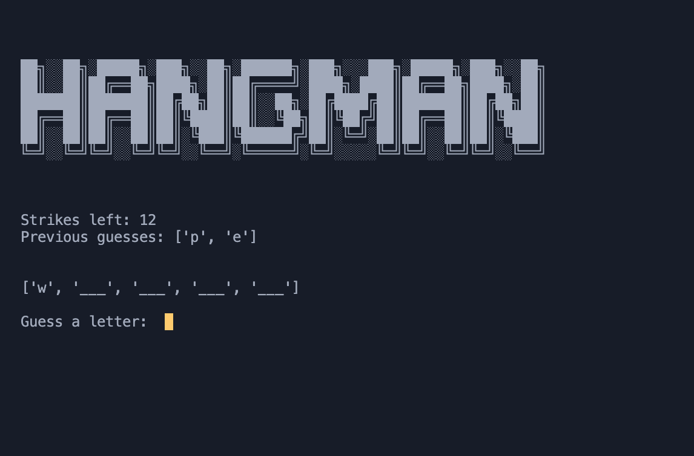

# Hangman

This is a simple program to try using OOP with Python for the first time.  To use this program, make sure you have Python 3 installed, clone the project, and run the hangman.py file!

 

